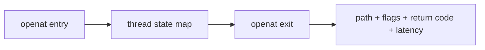

# Lab 2 — Who Touched This File—and Did It Fail?

Question: which pathname did a process pass to `openat`, what flags did it use, and what did the kernel return?

## Prerequisites

Complete the root [getting-started guide](../../docs/GETTING-STARTED.md) and `./scripts/build.sh`. Compare your run with [expected output](expected-output.txt); PIDs, paths, descriptors, and timestamps will differ.

## Run

Terminal 1:

```bash
sudo ./scripts/run-lab.sh 02-file-open --duration 10 --json
```

Terminal 2:

```bash
./target/release/file-fixture
```

The entry tracepoint stores path, flags, and start time in a hash map keyed by thread ID. The exit tracepoint joins the return value and emits one event. The fixture covers success, `ENOENT`, and `EACCES`. When invoked as root it temporarily drops only its effective UID for the `EACCES` call, then restores it and deletes its files.

## Exercise

Add a relative-path open to the fixture. Explain why the captured string alone does not identify an absolute file without the process working directory and directory file descriptor.

## Evidence boundary

The return code proves the syscall result. It does not explain higher-level configuration selection, and paths longer than 127 bytes are truncated.

Cleanup: automatic under `/tmp/ebpf-incident-file-<pid>`.

## Architecture and research



Motivation: [why syscall tracepoints and kprobes expose different interfaces](https://stackoverflow.com/questions/71668868/what-is-the-difference-between-syscalls-openat-and-sys-enter-openat).
