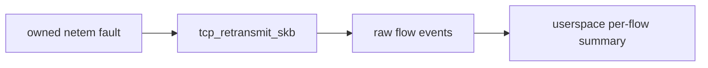

# Lab 5 — Why Does the Network Keep Retrying?

Question: did the kernel enter its TCP retransmission path while the symptom occurred?

## Prerequisites

Complete the root [getting-started guide](../../docs/GETTING-STARTED.md) and `./scripts/build.sh`. This lab is restricted to the disposable VM. Compare your run with [expected output](expected-output.txt); flow ports and event counts will differ.

## Run

This lab changes only the disposable VM loopback qdisc. Its trap removes that change on normal exit and interruption.

Terminal 1:

```bash
sudo ./scripts/run-lab.sh 05-tcp-retransmits --duration 15 --json
```

Terminal 2:

```bash
sudo ./scripts/run-retransmit-fixture.sh
```

The short 100% loss window deterministically forces a retry, then restoring loopback allows the single request to finish. Run it only in the disposable lab VM.

## Exercise

Repeat without `netem` and compare event counts over the same duration.

Each event includes the kernel tracepoint's source and destination tuple. The byte offsets are checked against `/sys/kernel/tracing/events/tcp/tcp_retransmit_skb/format` in every accepted environment rather than assumed from a desktop header.

## Evidence boundary

The raw event proves the retransmit tracepoint fired for that flow. The final `tcp_retransmit_summary` reports each flow's total, and `tcp_retransmit_histogram` groups flows into 1, 2–3, 4–7, and 8+ retransmission-count buckets. None proves whether loss, reordering, receiver delay, congestion, or another condition caused it.

Cleanup: the fixture removes only a qdisc it successfully created and refuses to replace an unexpected existing qdisc. Verify with `tc qdisc show dev lo`.

## Architecture and research



Motivation: incident discussions where rising tail latency must be separated from application processing time; the fixture supplies controlled loss without claiming it is the only retransmission cause.
