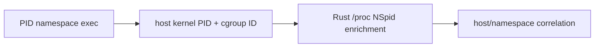

# Lab 6 — Why Is PID 1 Not PID 1?

Question: how does a namespace-visible PID relate to the PID observed at the host kernel boundary?

## Prerequisites

Complete the root [getting-started guide](../../docs/GETTING-STARTED.md) and `./scripts/build.sh`. Compare your run with [expected output](expected-output.txt); host PIDs and cgroup IDs will differ.

## Run

Terminal 1:

```bash
sudo ./scripts/run-lab.sh 06-namespace-pids --duration 12 --json
```

Terminal 2:

```bash
sudo unshare --fork --pid --mount-proc ./target/release/namespace-fixture
```

The event records the host PID and cgroup ID in the kernel. While the five-second fixture is alive, userspace reads the innermost `NSpid` value from `/proc/<host-pid>/status`.

## Exercise

Inspect the same process with `ps` on the host and inside the namespace. Add `--pid <host-pid>` to the observer and explain why the namespace PID is not accepted by the filter.

## Evidence boundary

`/proc` enrichment is racy for processes that exit immediately. A cgroup ID is an identity handle, not a container name; names require an external runtime lookup.

Cleanup: `unshare` tears down the namespace when the fixture exits.

Optional Docker extension: while the observer is ready, run `docker run --rm alpine:3.22 sh -c 'echo namespace-visible pid=$$; sleep 5'`, then correlate the container PID with the host event. Docker is not required for the core lab.

## Architecture and research



Motivation: [determining a process's namespaces from kernel space](https://stackoverflow.com/questions/48401989/how-can-i-determine-which-namespaces-a-pid-is-in-from-kernel-space/48404561).
