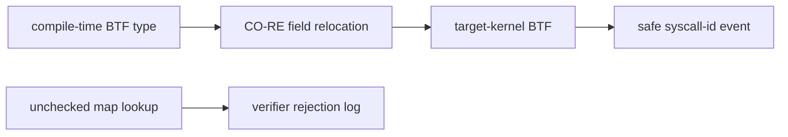

# Lab 7 — Reading Verifier Errors and Surviving Kernel Drift

Question: can the verifier prove every memory access is safe on this kernel?

## Prerequisites

Complete the root [getting-started guide](../../docs/GETTING-STARTED.md) and `./scripts/build.sh`. Lab 7 additionally requires Clang's BPF target and readable target-kernel BTF. Compare your run with [expected output](expected-output.txt); PIDs and timestamps will differ.

## Run

## Safe program

```bash
sudo ./scripts/run-lab.sh 07-verifier-portability --duration 5 --json
```

Write activity during the bounded run emits `verifier_demo` events.

## Deliberately rejected program

```bash
sudo INCIDENT_VERIFIER_BROKEN=1 ./scripts/run-lab.sh 07-verifier-portability --duration 5
```

The broken variant dereferences a map-lookup result without proving it is
non-null. Failure to load is the expected result. Save the complete error chain
and find the first instruction where the verifier still considers the register
`map_value_or_null`.

## Exercise

Record the safe and rejected results on the Ubuntu 6.8 GA kernel and the current HWE kernel. Report differences without assuming one verifier is “wrong.”

## Evidence boundary

The safe probe reads the syscall tracepoint's `id` field through a CO-RE-annotated kernel type, producing a BTF field relocation that Aya resolves against the running kernel. It is deliberately implemented as a tiny C eBPF object and loaded by the Rust/Aya runner: testing showed that this repository's Rust/bpf-linker path emitted BTF but no CO-RE relocation records. BTF/CO-RE relocates type and field layout references; it does not promise the same helper availability, attach points, program limits, or verifier reasoning across all kernels.

Cleanup: none; a rejected program never attaches, and the safe program is bounded.

## Architecture and research



Motivation: [a verifier map-value failure](https://stackoverflow.com/questions/79095876/bpf-probe-read-user-permission-denied-invalid-access-to-map-value-in-an-ebp) and [reported verifier drift across kernels](https://www.reddit.com/r/eBPF/comments/1ucpldb/verifier_behavior_drift_across_kernels_how_are/).
